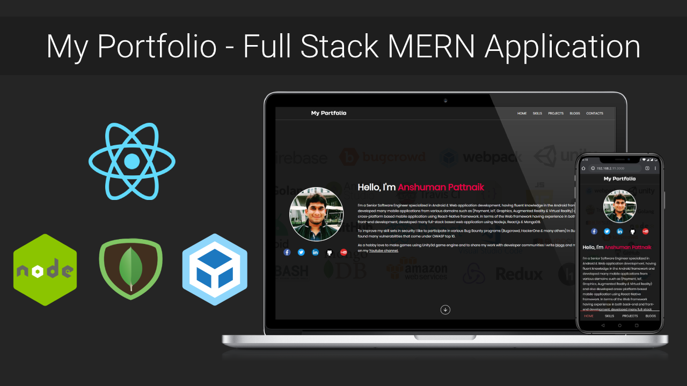

## Technical Overview
A portfolio site is essential for every software developer to showcase projects and technical skills which demonstrates what you can do based upon your resume. 

So I have built my site using react.js as a front end, node.js as a back-end, and MongoDB as storage, for better performance I have implemented server-side rendering technique which is a very popular technique for rendering client-side webpage on the server and server will send the complete result to the client, and to bundle the module I have used Webpack which is a module bundler to bundle javascript, front-end assets.



### Website Link
[https://myportfolio.hackbotone.com](https://myportfolio.hackbotone.com)

### MongoDB database import command
Please import the databases after cloning this repo.

`````````````````````````````````````
git clone https://github.com/anshumanpattnaik/reactjs-portfolio-mern-website.git

cd reactjs-portfolio-mern-website/databases

mongoimport --uri "mongodb://127.0.0.1:27017/portfolio" --collection skills --jsonArray --file skills.json
mongoimport --uri "mongodb://127.0.0.1:27017/portfolio" --collection projects --jsonArray --file projects.json
mongoimport --uri "mongodb://127.0.0.1:27017/portfolio" --collection blogs --jsonArray --file blogs.json
`````````````````````````````````````

### Installation
``````````````````````````````````````
cd reactjs-portfolio-mern-website

yarn add
yarn run start
``````````````````````````````````````
Open http://localhost:3000 to view it in the browser.

### Website Design & Developed by
[Anshuman Pattnaik](https://www.linkedin.com/in/anshuman123/)

### License
This project is licensed under the [MIT License](LICENSE)
